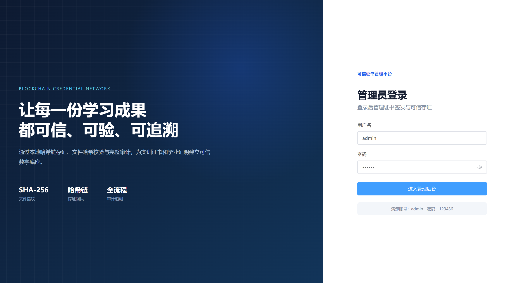
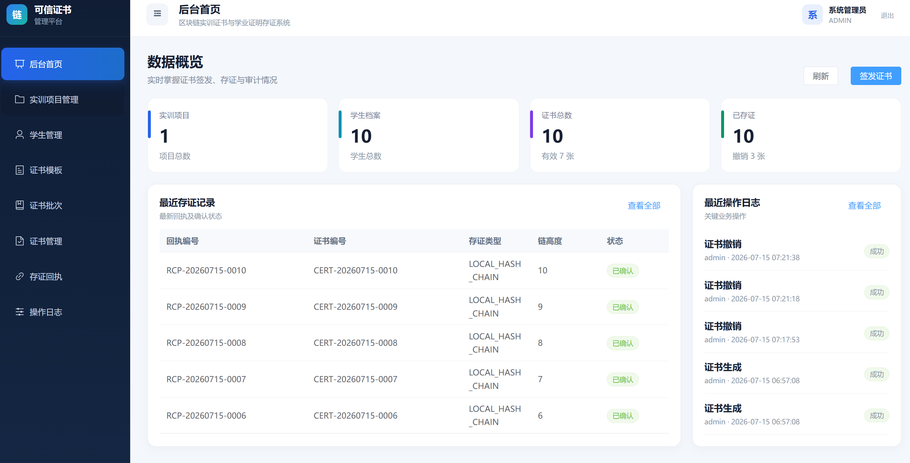
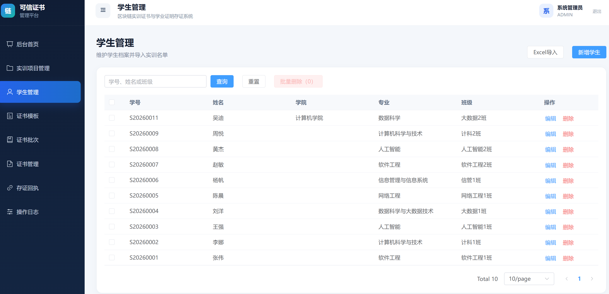
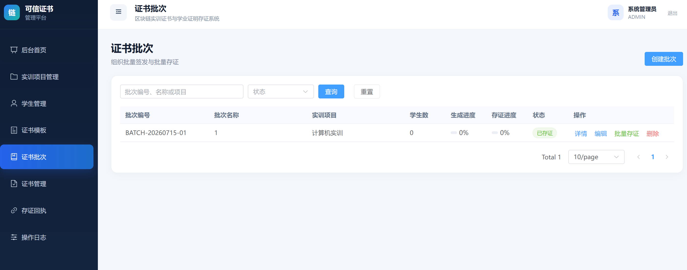
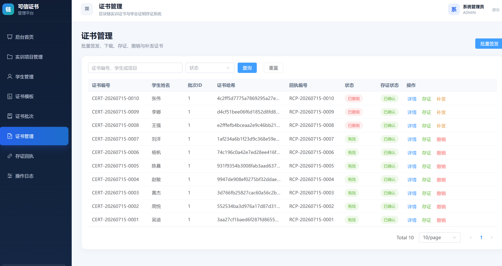
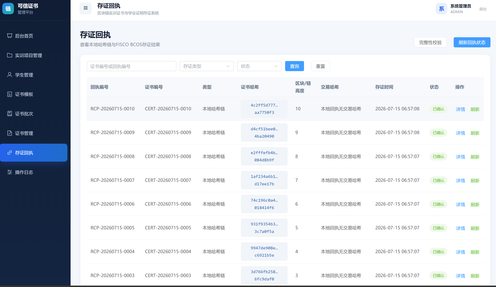
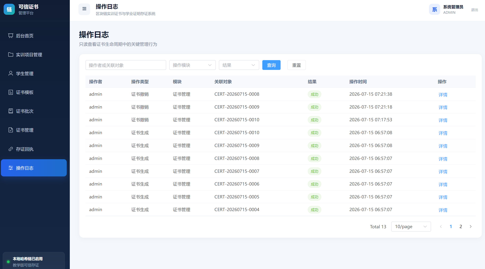

# 管理员前端 7-15 交付

本文档汇总管理员前端截至 2026 年 7 月 15 日的真实接口联调、页面截图、功能调整、接口问题和构建结果。本次前端使用 Vue 3，与 FastAPI + MySQL 后端进行局域网联调。

## 1. 今日交付结论

| 交付物 | 验收标准 | 当前结果 |
| --- | --- | --- |
| 管理端截图 | 至少 6 张，覆盖主导航 | 已完成 7 张 |
| 前端接口问题清单 | 写明路径、参数和错误现象 | 已整理，见第 5 节 |
| 构建结果 | `npm --prefix frontend run build` 成功截图或日志 | 本地执行 `npm run build` 成功 |
| 演示可用页面 | 批次、证书、回执三页可展示接口数据 | 页面已可展示；最终验收以数据库持久化数据为准 |

## 2. 页面截图

截图统一保存在 `docs/协作管理/2026-07-15截图/`。

### 2.1 登录页



### 2.2 后台首页



### 2.3 学生管理



### 2.4 证书批次



### 2.5 证书管理



### 2.6 存证回执



### 2.7 操作日志



## 3. 今日完成内容

- 管理员端已切换为真实接口模式：`VITE_USE_MOCK=false`。
- 完成登录、首页统计、学生、模板、批次、证书、回执和审计日志页面联调检查。
- 证书列表继续使用冻结字段：`certificate_no`、`student_name`、`batch_id`、`certificate_hash`、`receipt_id`、`status`。
- 学生 Excel 批量导入已验证；学院字段导入、编辑和刷新保存问题已由后端修复。
- 学生列表增加多选和批量删除入口，复用单条删除接口，并展示成功、失败数量。
- 修复 TEACHER 访问 403 页面后“返回首页”无响应的问题。
- 登录后及根路径按角色跳转：ADMIN 到首页、TEACHER 到项目页、AUDITOR 到回执页。
- ADMIN、TEACHER、AUDITOR 菜单和路由权限保持区分。

## 4. 真实接口与数据说明

模拟学生信息可通过 Excel 和真实 FastAPI 接口写入 MySQL。虽然姓名和学号是模拟数据，但只要数据经过真实接口、写入数据库并在刷新后保留，即属于联调验收数据。

证书不通过 Excel 导入，完整流程为：

```text
Excel 导入学生
→ 创建证书模板
→ 创建证书批次
→ 批量签发/生成证书
→ 单张或批量存证
→ 生成存证回执和审计日志
```

## 5. 前端接口问题清单

### 5.1 删除学生出现 Network Error

- 接口：`DELETE /api/admin/students/{student_id}`
- 请求参数：路径参数 `student_id`
- 前端现象：确认删除后提示 `Network Error`，列表数据未删除。
- 影响：单条删除和前端批量删除均可能失败。
- 待核查：后端 DELETE 路由、MySQL 外键约束、CORS 的 OPTIONS/DELETE 放行、后端运行日志及联调网络状态。

### 5.2 撤销证书后补发出现 Network Error

- 接口：`POST /api/admin/certificates/{certificate_id}/reissue`
- 路径参数：`certificate_id`
- 请求体示例：

```json
{
  "reason": "证书信息更正",
  "issue_date": "2026-07-15"
}
```

- 前端现象：已撤销证书填写补发原因和新签发日期后，点击确认补发提示 `Network Error`，未看到新证书。
- 影响：暂时无法验收新旧证书关联、补发 PDF、补发存证和对应审计日志。
- 待核查：后端补发接口、数据库事务、PDF/二维码生成过程、CORS 响应和 FastAPI traceback。

### 5.3 已解决问题

- Excel 导入学生时学院字段未保存：已解决。
- 编辑学生学院后刷新恢复为“示范学院”：已解决。
- TEACHER 在 403 页面点击“返回首页”无响应：前端已修复。

## 6. 构建结果

在本地管理员前端目录执行：

```powershell
cd D:\实训\admin-web
npm run build
```

构建结果：

```text
✓ 1700 modules transformed
✓ built in 7.7s
```

TypeScript 检查和 Vite 生产构建均通过，构建产物位于 `dist/`。

## 7. 角色权限验证

| 页面或功能 | ADMIN | TEACHER | AUDITOR |
| --- | --- | --- | --- |
| 后台首页 | 可访问 | 不可访问 | 不可访问 |
| 项目、学生、模板、批次、证书 | 可访问 | 可访问 | 不可访问 |
| 存证回执 | 可访问 | 可访问 | 可访问，只读查看 |
| 操作日志 | 可访问 | 不可访问 | 可访问，只读 |

角色默认入口：

- ADMIN：`/dashboard`
- TEACHER：`/projects`
- AUDITOR：`/chain`

## 8. 风险与阻塞

### 当前阻塞

1. 删除学生接口仍可能出现 `Network Error`，需结合后端日志确认是网络、CORS、外键还是接口异常。
2. 撤销后补发接口出现 `Network Error`，补发闭环尚未验收。
3. 撤销成功后仍需由后端负责人核对数据库 `status` 和审计日志，由验真端负责人核对公共验真结果。

### 非阻塞风险

- 生产构建主 JavaScript chunk 约 1.10 MB，超过 Vite 默认 500 kB 警告阈值。
- 当前不影响功能、构建和课堂演示，记录为非阻塞性能风险。
- 后续可通过动态导入、依赖拆包和 `manualChunks` 优化。

## 9. 后续验收步骤

1. 后端修复学生删除和证书补发问题并重启服务。
2. 重新测试删除、批量删除、撤销和补发按钮反馈。
3. 确认证书补发后生成新证书，旧证书不覆盖，并保留关联关系。
4. 核对数据库状态、存证回执、操作日志和公共验真结果。
5. 如截图内容发生变化，更新对应截图后再提交到 `dev`。
